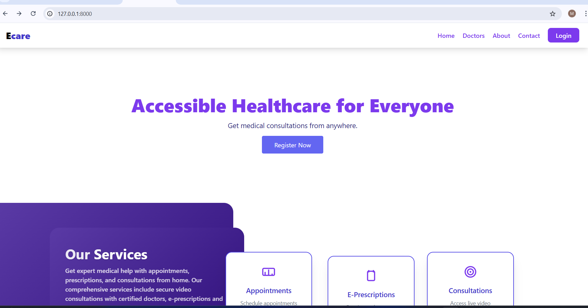
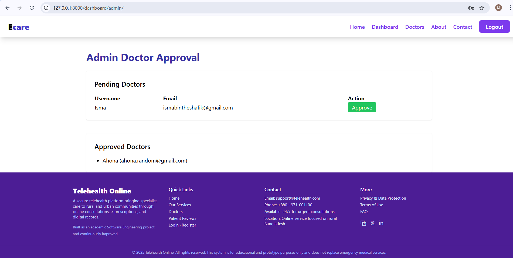
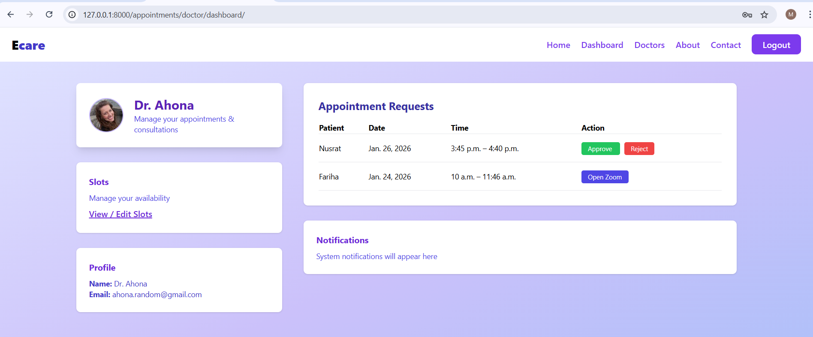
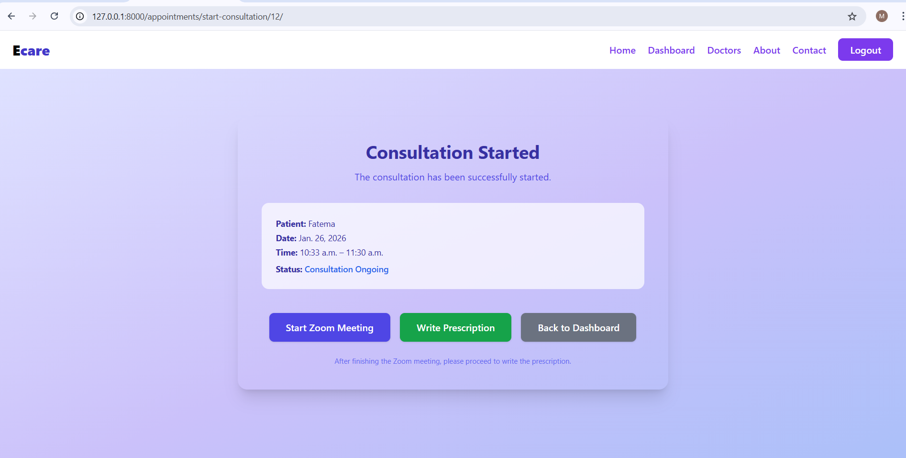
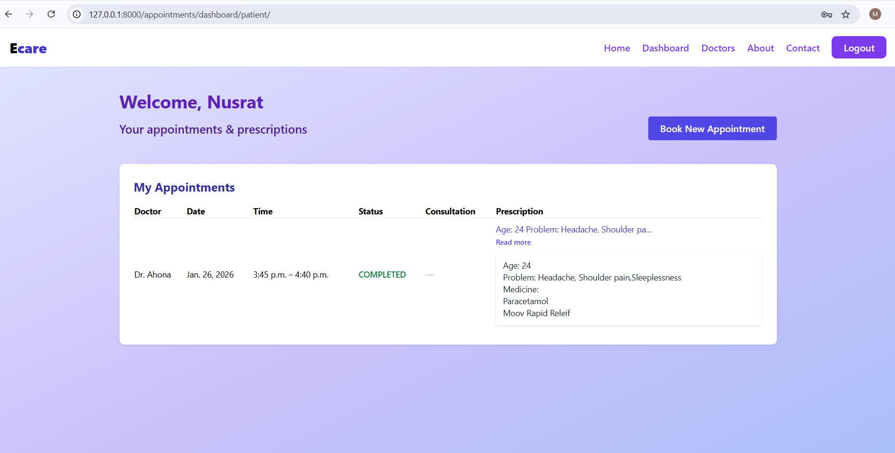
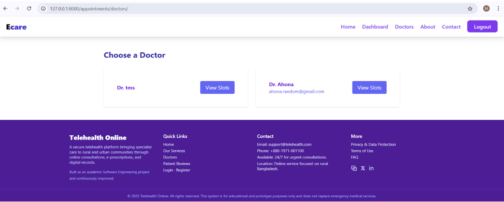
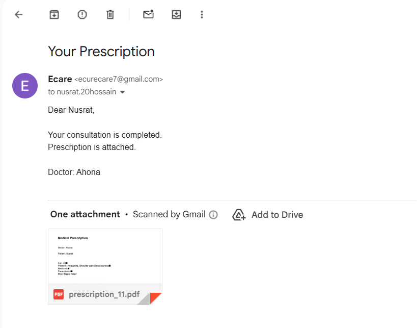

# 🏥 Telehealth Management System

A **full-featured Django-based Telehealth Management System** designed to connect **patients and doctors** through a simple, clean, and user-friendly web interface.

This project focuses on **real-world healthcare workflow**, including appointment scheduling, consultations, and prescription handling.


## 🖼️ User Interface Screenshots

### 🏠 Home Page
  
Landing page introducing the telehealth system and its core features. Logged in as doctor and approved by admin

### 🛠️ Admin Dashboard
  
Admin panel for managing users, doctors to have a secure system.


### 🧑‍⚕️ Doctor Dashboard
  
Doctor dashboard displaying appointments, consultations, and daily activities by approving/rejecting patients booked appointments.


### 🧑‍⚕️ Doctor Availability & Bookings

Doctor’s availability and booked appointment slots overview.


### 💬 Consultation & Prescription
  
Consultation with zoom link and an interface where doctors create and manage patient prescriptions.


### 🧑‍🤝‍🧑 Patient Dashboard
  
Patient dashboard to view appointments, consultations, and prescriptions.


### 📅 Patient Appointments

Patient-side appointment list with booking and appointment status tracking.


### 📄 Prescription PDF Email
  
Automatically generated prescription PDF sent to the patient via email.


### 📧 Zoom Consultation Email
.png)  
Email notification containing Zoom consultation meeting details.


## 🚀 Features Breakdown

### 👤 Authentication
- Secure login & registration
- Role-based dashboard access

### 🩺 Appointment System
- Doctors set available slots
- Patients book appointments
- Appointment approval workflow

### 💊 Consultation & Prescription
- Start consultation
- Write prescriptions and generate PDF.
- Doctor diary & history

---

## 🛠️ Tech Stack

- **Backend:** Django
- **Frontend:** HTML, CSS, Bootstrap
- **Database:** SQLite (Development)
- **Authentication:** Django Auth
- **Version Control:** Git & GitHub

---

## ⚙️ Installation Guide

```bash
git clone https://github.com/Fariha-Ahona/telehealth.git
cd telehealth
python -m venv venv
venv\Scripts\activate
pip install -r requirements.txt
python manage.py migrate
python manage.py runserver
